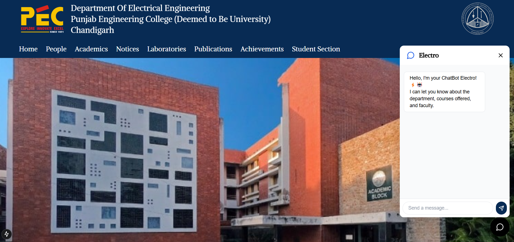
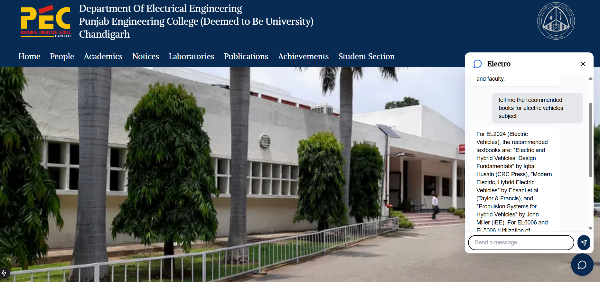
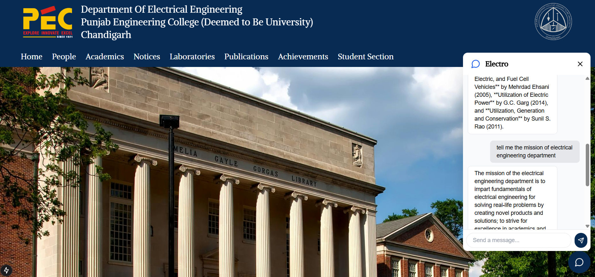

# ⚡ Electro ChatBot — PEC Electrical Department Assistant 

A smart, AI-powered chatbot designed to assist students, faculty, and visitors by answering queries related to the Department of Electrical Engineering at PEC University of Technology.( The website is under development yet)

---

## 🧠 Features

- ✅ Answers questions about department faculty, courses, and general info.
- ✅ Built with **LangChain**, **OpenAI embeddings**, **FAISS**, and **Gemini LLM**.
- ✅ Integrated into university department **Next.js website** via a responsive floating chat widget.
- ✅ Deployed with **Flask backend** and supports cross-origin access.
- ✅ Efficient retrieval using **vector embeddings** and RAG (Retrieval-Augmented Generation).
- ✅ Input length + output length are controlled to prevent abuse and optimize cost.

---

## 🏗️ Tech Stack

| Layer        | Technology                        |
|--------------|-----------------------------------|
| Frontend     | Next.js (React), Tailwind, Lucide |
| Backend API  | Flask (Python)                    |
| RAG Pipeline | LangChain + FAISS + OpenAI        |
| LLM Model    | Gemini 1.5 Flash (`gemini-1.5-flash`) |
| Embeddings   | OpenAI (`text-embedding-3-small`) |
| Data Format  | Plain `.txt` files, split by paragraph |

---

---

## ⚙️ How It Works

1. **Data Preprocessing**:
   - Faculty, course, and department info is structured into paragraphs in `.txt` files.
   - Each paragraph represents one unit of retrievable context.

2. **Embedding and Indexing**:
   - `ingest.py` reads all `.txt` files.
   - OpenAI's `text-embedding-3-small` model converts each paragraph into vector form.
   - FAISS stores these vectors in a searchable index (`faiss_index/`).

3. **Query Handling**:
   - User inputs a question in the web chat widget.
   - Frontend sends the query to the Flask API (`/chat`).
   - The backend embeds the query, retrieves top matches from FAISS, and sends them with the prompt to Gemini 1.5 Flash.
   - Gemini generates a context-aware response and returns it to the user.

---

### 🔧 Prerequisites

- Python 3.12+
- Node.js 18+ (for Next.js frontend)
- API keys:
  - OpenAI API Key
  - Google Generative AI Key (for Gemini)

